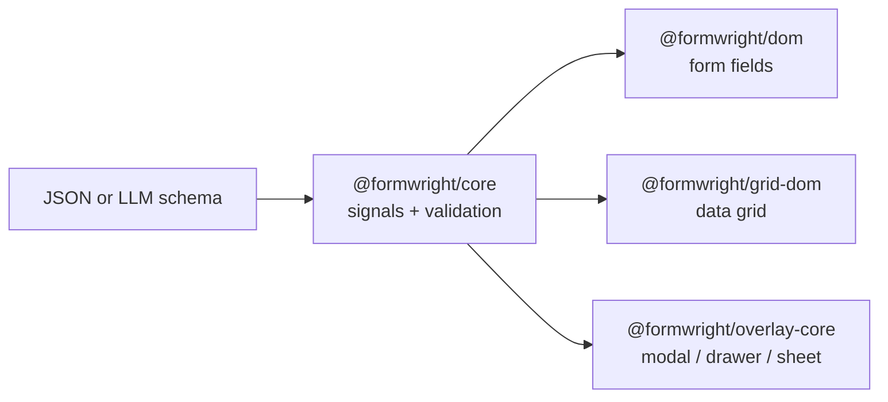
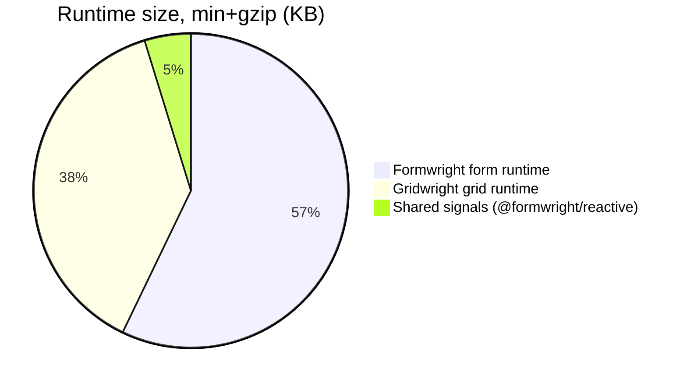
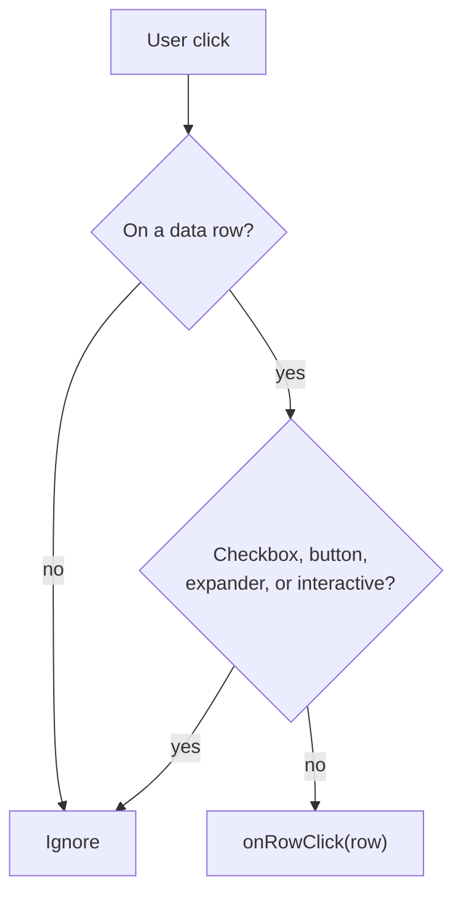

# Formwright

Schema in. Live UI out. Forms, grids, and overlays from **data** — not JSX.

Hand-write a JSON schema, or generate one from a sentence. The signal engine updates only the node that changed (no virtual DOM). ~12 KB gzipped for the form runtime, zero third-party dependencies.

**Try it:** [Home](https://aliarsalan177.github.io/formwright/) · [Form playground](https://aliarsalan177.github.io/formwright/playground.html) · [Gridwright](https://aliarsalan177.github.io/formwright/grid.html) · [Forge](https://aliarsalan177.github.io/formwright/forge.html) · [Storybook](https://aliarsalan177.github.io/formwright/storybook/)



## Which package?

| You want            | Install                                          | First call                                      |
| ------------------- | ------------------------------------------------ | ----------------------------------------------- |
| A form              | `@formwright/core` + `@formwright/dom`           | `new Form(schema).mount(el)`                    |
| A data grid         | `@formwright/grid-core` + `@formwright/grid-dom` | `new Grid(schema, rows)` then `mount(grid, el)` |
| A modal / drawer    | `@formwright/overlay-core`                       | `overlay.modal({ title, body })`                |
| Schema from English | `@formwright/ai`                                 | `generateSchema("a 3-step signup")`             |



---

## Form — 30 seconds

```bash
npm i @formwright/core @formwright/dom
```

```ts
import { Form } from "@formwright/core";
import "@formwright/dom";

const form = new Form(
  {
    id: "signup",
    version: "1.0",
    title: "Create your account",
    fields: [
      {
        id: "email",
        type: "email",
        label: "Email",
        validation: { kind: "string", format: "email", required: true },
      },
      {
        id: "country",
        type: "select",
        label: "Country",
        options: [
          { label: "United States", value: "US" },
          { label: "Canada", value: "CA" },
        ],
      },
      {
        id: "state",
        type: "text",
        label: "State",
        visibleWhen: { "==": [{ var: "country" }, "US"] },
      },
    ],
    submit: { endpoint: { method: "POST", url: "/api/signup" } },
  },
  { email: "" },
);

form.mount(document.getElementById("root")!);
form.subscribe((values) => console.log(values));
```

No CDN build step:

```html
<script type="module">
  import { Form } from "https://esm.sh/@formwright/core";
  import "https://esm.sh/@formwright/dom";
</script>
```

### React (same engine)

```tsx
function SignupForm({ schema }) {
  const ref = useRef<HTMLDivElement>(null);
  useEffect(() => {
    const form = new Form(schema);
    form.mount(ref.current!);
    return () => form.destroy();
  }, [schema]);
  return <div ref={ref} />;
}
```

---

## Gridwright — 30 seconds

```bash
npm i @formwright/grid-core @formwright/grid-dom
```

```ts
import { Grid } from "@formwright/grid-core";
import { mount } from "@formwright/grid-dom";

const grid = new Grid(
  {
    id: "members",
    rowIdField: "id",
    columns: [
      { field: "name", flex: 2 },
      { field: "status", width: 100 },
      { field: "balance", type: "number", width: 110 },
    ],
  },
  rows,
  { pagination: { pageSize: 25 }, selection: "multi" },
);

mount(grid, document.getElementById("app")!, {
  onRowClick: (row) => openDetail(row),
});
```

`onRowClick` fires on the row, not on checkboxes, expanders, pager buttons, or anything marked `[data-gw-interactive]`. Every data row has `data-row-id`. Column `class` is copied onto header cells as well as body cells.



Live demo: [grid.html](https://aliarsalan177.github.io/formwright/grid.html) (50k rows, server pages, grouping).

---

## Overlaywright — 30 seconds

```bash
npm i @formwright/overlay-core
```

```ts
import { overlay } from "@formwright/overlay-core";

overlay.modal({
  title: "Receipt R-000123",
  size: "sm",
  body: [{ type: "fields", items: [{ label: "Total", value: "PKR 3,000" }] }],
  actions: [{ name: "close", label: "Close", role: "cancel" }],
});

const ok = await overlay.confirm({
  title: "Cancel this receipt?",
  danger: true,
});
```

Same stack for `overlay.drawer({ side: "right" })` and `overlay.sheet()` (bottom sheet). Open from anywhere — the store lives on `globalThis`, so a keyboard shortcut and a React button share one overlay host.

---

## Everyday form patterns

**Field types:** `text` `email` `password` `number` `textarea` `select` `radio` `checkbox` `toggle` `phone` `color` `range` `date` `time` `datetime` `daterange` `file` `heading` `separator` `paragraph` `group` `collection` `steps` `step` — plus any widget you register.

**Show / hide as data** (no `eval`):

```json
{
  "id": "promoCode",
  "type": "text",
  "visibleWhen": {
    "and": [{ "==": [{ "var": "plan" }, "pro"] }, { "var": "agree" }]
  }
}
```

Operators: `==` `!=` `>` `>=` `<` `<=` `in` `and` `or` `not` `var`. Hidden fields are dropped from the payload.

**Nested objects and lists:**

```ts
{ id: "billing", type: "group", fields: [{ id: "city", type: "text" }] }
{ id: "contacts", type: "collection", minItems: 1, fields: [{ id: "email", type: "email" }] }
```

Payload: `{ billing: { city: "London" }, contacts: [{ email: "a@x.com" }] }`

**Wizard:** wrap steps in `type: "steps"`. Next validates the current step; Submit validates all. Optional `urlSync`, draft `persist`, and a `success` screen.

**Drafts:** `persist: { mode: "consent" }` plus `{ persistKey: "signup" }` on `new Form`. Resume banner on restore; cleared on submit.

**Async select options:**

```ts
options: { $query: "countries", lazy: true, map: { label: "name", value: "code" } }
```

**Your component:** `registerWidget("rating", { mount(host, b) { … } })` then `"widget": "rating"` in the schema. Custom elements need no adapter: `"widget": { "tag": "fw-rating", "event": "rating-change" }`.

**Styling:** unstyled hooks (`.fw-field`, `.gw-grid`, …). Or per-field `class` / `classes` with Tailwind.

**AI:**

```ts
import { generateSchema } from "@formwright/ai";
const { schema } = await generateSchema("a 3-step signup wizard");
new Form(schema).mount(el);
```

**Imperative:** `form.subscribe`, `form.getValues()`, `form.setValue(path, v)`, `form.submit()`, `form.reset()`, `form.destroy()`.

---

## Gridwright capabilities

| Feature         | What you get                                            |
| --------------- | ------------------------------------------------------- |
| Virtualization  | Visible window only (tested at 50k rows)                |
| Surgical cells  | One cell update does not re-render the row              |
| Pagination      | Client or server `{ rows, total }`                      |
| Selection       | Single / multi, select-all-on-page                      |
| Row click       | `onRowClick` — controls are ignored                     |
| Master / detail | Expand a row, mount a form, a grid, or a chart          |
| Grouping        | `groupBy` + `aggFunc` + grand total                     |
| Sort / filter   | Multi-column sort, per-column + quick filter            |
| Columns         | Resize, reorder, pin, hide — `class` on header and body |
| Export          | `downloadCsv`                                           |

---

## Packages

| Package                      | Role                             | Size (min+gzip)  |
| ---------------------------- | -------------------------------- | ---------------- |
| `@formwright/schema`         | Form schema + validator          | ~1.2 KB          |
| `@formwright/core`           | `Form` class + signals           | ~5.8 KB          |
| `@formwright/dom`            | Direct-DOM form renderer         | ~4.8 KB          |
| `@formwright/ai`             | Description → validated schema   | server, optional |
| `@formwright/grid-schema`    | Grid schema                      | ~1.5 KB          |
| `@formwright/grid-core`      | `Grid` engine                    | ~5 KB            |
| `@formwright/grid-dom`       | Virtualized / flow renderer      | ~4 KB            |
| `@formwright/reactive`       | Shared signal engine             | ~1 KB            |
| `@formwright/overlay-schema` | Overlay schema                   | small            |
| `@formwright/overlay-core`   | `overlay.modal` / drawer / sheet | small            |

The only runtime dependency of the form and grid packages is `@formwright/reactive` (ours). ESM + CJS + types; works from `esm.sh`.

---

## Security

Schemas are **data, not code**. Labels and option text render as `textContent`. Conditions use a sandboxed JSONLogic evaluator — no `eval`, no `innerHTML`. Re-validate every payload on the server. If you mount a custom widget, you own how it renders values.

---

## Local playground

```bash
git clone https://github.com/aliarsalan177/formwright.git
cd formwright
pnpm install && pnpm build
pnpm --filter @formwright/playground dev
```

[http://localhost:5173](http://localhost:5173) · forms at `/playground.html` · grid at `/grid.html`

```bash
pnpm test
pnpm storybook   # http://localhost:6006
```

See [CONTRIBUTING.md](CONTRIBUTING.md). MIT licensed.

## Roadmap

- `@formwright/react` / `@formwright/vue` / `<formwright-form>` web component
- `@formwright/overlay-dom` default renderer for Overlaywright
- First-party i18n and TanStack Query providers
